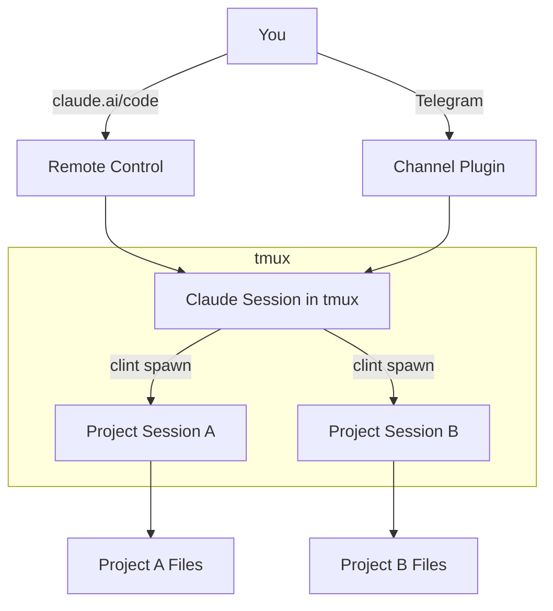
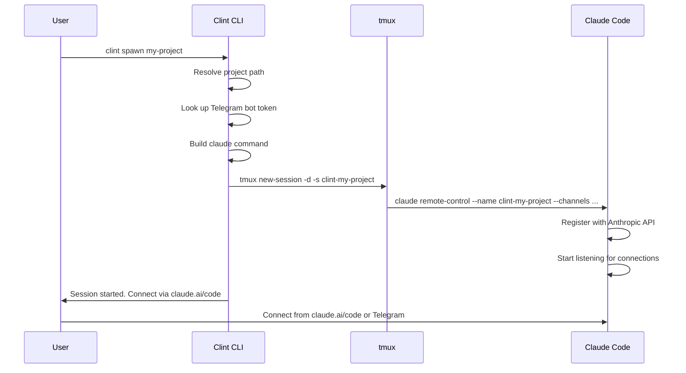

# Architecture

## Overview

Clint is a TypeScript CLI built with [oclif](https://oclif.io/) and [Bun](https://bun.sh). It orchestrates Claude Code sessions using tmux for persistence and Claude's Remote Control + Channels features for remote access.



## Components

### CLI (`src/commands/`)

Each command is an oclif Command class:

| File | Command | Purpose |
|------|---------|---------|
| `start.ts` | `clint start` | Launch HQ session |
| `spawn.ts` | `clint spawn` | Spawn project session |
| `list.ts` | `clint list` | List projects + worktrees |
| `status.ts` | `clint status` | Show running sessions |
| `stop.ts` | `clint stop` | Stop a session |
| `stop-all.ts` | `clint stop-all` | Stop all sessions |
| `attach.ts` | `clint attach` | Attach to tmux session |

### Services (`src/services/`)

Shared logic used by commands:

| File | Purpose |
|------|---------|
| `tmux.ts` | tmux session lifecycle (create, kill, list, attach) |
| `claude.ts` | Build `claude remote-control` command strings |
| `projects.ts` | Project discovery, worktree detection, worktree creation |
| `telegram.ts` | Bot token management, state directory isolation |

### Config (`src/config/`)

| File | Purpose |
|------|---------|
| `schema.ts` | TypeScript types and defaults |
| `index.ts` | TOML config loading, env var overrides, validation |

## Key Design Decisions

### tmux IS the State

There's no database or state file. tmux sessions are the source of truth:

- `tmux list-sessions` → running sessions
- `tmux has-session -t name` → session exists?
- `tmux kill-session -t name` → stop a session

This is simple and reliable. If tmux says it's running, it's running.

### Bot-per-Project Telegram

Each project can have its own Telegram bot. This is the only way to get separate chat threads — Telegram doesn't support bot-initiated threads in DMs.

Implementation: each bot gets its own `TELEGRAM_STATE_DIR` so pairing data, allowlists, and session state are isolated.

### Worktrunk Integration

Clint prefers `wt list --format=json` over `git worktree list` because Worktrunk provides richer data (branch status, current worktree flag, etc.) and respects per-project configuration.

For worktree creation, `wt switch -c <branch>` is used instead of `git worktree add` because Worktrunk handles:
- Path template resolution (sibling directories)
- Post-create hooks (dependency installation, etc.)
- Shell directory change

### No Default Secrets

Following the project's coding standards: environment variables that must be configured for the app to work (like `hq_bot_token`) throw errors if missing. No silent fallbacks.

## Directory Structure

```
~/work/clint/
├── bin/
│   ├── dev.ts          # Development entrypoint (bun)
│   └── run.js          # Production entrypoint (node)
├── src/
│   ├── commands/       # oclif commands
│   ├── services/       # Shared business logic
│   ├── config/         # Config loading + types
│   └── utils/          # Path helpers, logging
├── docs/               # Documentation (docmd)
├── logs/               # Session logs (gitignored)
├── CLAUDE.md           # Instructions for the HQ Claude session
├── docmd.config.js     # Documentation site config
├── package.json        # Dependencies + oclif config
└── tsconfig.json       # TypeScript config
```

## Session Lifecycle


